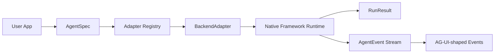
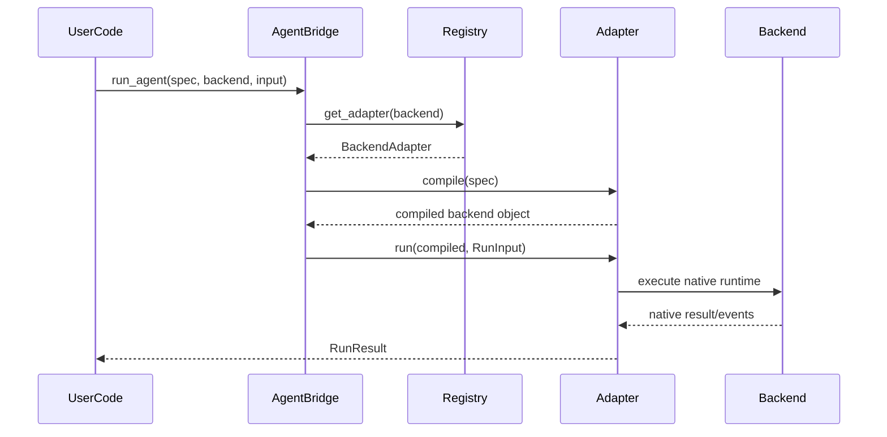

# AgentBridge

[](https://github.com/0sparsh2/agent-framework-connector/actions/workflows/ci.yml)

AgentBridge is a Python SDK for defining an agent once and running it across multiple agent frameworks.

The first wedge is migration: teams can prototype in a high-level framework, validate tool and prompt behavior through a stable interface, then move toward a more durable production runtime without rewriting the application layer.

> AG-UI standardizes agent-to-frontend interaction. LiteLLM standardizes model-provider access. AgentBridge standardizes app-to-agent-framework compatibility.

## What This Repo Contains

- A framework-neutral `AgentSpec` for instructions, model strings, tools, metadata, and backend options.
- Normalized `RunInput`, `RunResult`, and `AgentEvent` types.
- A `BackendAdapter` interface for adding or replacing agent runtimes.
- Built-in `mock`, `pydantic_ai`, and `langgraph` adapters.
- A lightweight plugin system so heavy adapters can live outside the core package.
- Static JSON/YAML manifests for CLI-driven validation, comparison, and demos.
- AG-UI-shaped event conversion for frontend protocol compatibility.
- Documentation for requirements, research, architecture, version policy, capabilities, and plugin authoring.

AgentBridge is not trying to hide every framework-specific strength behind a tiny wrapper. The long-term design is capability-aware: common features stay in the core API, advanced features are declared through backend capabilities, and native framework objects remain available as escape hatches.

## Status

This is an MVP foundation, not a production-stable release. The repo is useful today for exploring the abstraction, writing adapter contracts, testing migration stories, and validating whether a shared app-to-agent layer is worth pursuing.

Current backend status:

| Backend | Package Path | Status | Notes |
| --- | --- | --- | --- |
| `mock` | Core | Verified | Deterministic backend for tests, docs, and no-key demos. |
| `langgraph` | Core optional extra | Verified locally | Executes a minimal graph and supports normalized results/events. |
| `pydantic_ai` | Core optional extra | Verified locally | Uses `pydantic-ai-slim`; offline tests use Pydantic AI test utilities. |
| `crewai` | External plugin scaffold | Blocked | Lives in `plugins/agentbridge-crewai` because current dependency resolution is not core-friendly. |

Adopted package versions are tracked in [docs/version_policy.md](docs/version_policy.md).

## Installation

For local development:

```bash
git clone https://github.com/0sparsh2/agent-framework-connector.git
cd agent-framework-connector
python -m venv .venv
source .venv/bin/activate
pip install -e ".[dev]"
```

Install optional real framework adapters as needed:

```bash
pip install -e ".[langgraph]"
pip install -e ".[pydantic-ai]"
pip install -e ".[all]"
```

The core package intentionally keeps heavyweight or fragile frameworks out of the default dependency path.

## SDK Quickstart

```python
from agentbridge import AgentSpec, ToolSpec, run_agent


def check_order(order_id: str) -> str:
    """Return the refund status for an order."""
    return f"Order {order_id} is eligible for a refund."


agent = AgentSpec(
    name="refund_agent",
    instructions="Decide whether a customer is eligible for a refund.",
    model="openai/gpt-5",
    tools=[ToolSpec.from_function(check_order)],
)

result = run_agent(
    agent,
    backend="mock",
    input="Customer says order A123 was double charged.",
)

print(result.output)
print(result.backend)
```

The same `AgentSpec` can be sent to another backend once that backend's optional dependency is installed:

```python
result = run_agent(agent, backend="langgraph", input="Check refund eligibility.")
```

Model routing follows LiteLLM-style model strings such as `openai/gpt-5`, `anthropic/claude-sonnet`, or `google/gemini`. AgentBridge does not build a custom model-provider abstraction in v0.

## Streaming Quickstart

```python
from agentbridge import AgentSpec, stream_agent

agent = AgentSpec(
    name="research_agent",
    instructions="Research the user request and explain the result clearly.",
    model="openai/gpt-5",
)

for event in stream_agent(agent, backend="mock", input="Summarize AgentBridge"):
    print(event.type, event.data)
```

`AgentEvent` objects normalize message, tool-call, tool-result, error, and completion events. They can also be converted into AG-UI-shaped dictionaries:

```python
from agentbridge.agui import to_agui_event

agui_event = to_agui_event(event)
```

## Manifest Quickstart

AgentBridge also supports static manifests for CLI usage:

```yaml
name: refund_agent
instructions: Decide whether a customer is eligible for a refund.
model: openai/gpt-5
tools:
  - name: check_order
    description: Return refund eligibility for an order.
metadata:
  owner: support
```

Run a manifest without requiring API keys:

```bash
agentbridge run \
  --manifest examples/refund_agent.yaml \
  --backend mock \
  --input "Customer says order A123 was double charged" \
  --json
```

Validate a migration target before running:

```bash
agentbridge validate \
  --manifest examples/refund_agent.yaml \
  --backend mock \
  --backend langgraph \
  --json
```

Static manifests do not deserialize arbitrary Python functions. Tool names resolve through an explicit tool registry, which keeps CLI workflows safe and predictable.

## CLI

```bash
agentbridge list-backends
agentbridge inspect-backend langgraph --json
agentbridge run --manifest examples/refund_agent.yaml --backend mock --input "Customer was double charged" --json
agentbridge compare --manifest examples/refund_agent.yaml --backend mock --backend langgraph --json
agentbridge validate --manifest examples/refund_agent.yaml --backend mock --backend langgraph --json
agentbridge capability-matrix --markdown
agentbridge versions --json
agentbridge plugins --json
agentbridge scaffold-plugin plugins/agentbridge-google-adk --backend google_adk
```

See [docs/cli.md](docs/cli.md) for command details.

## Architecture



Execution follows a simple path:



Deeper diagrams and design notes are in [docs/architecture.md](docs/architecture.md) and [docs/design.md](docs/design.md).

## Adapter Plugins

Heavy, blocked, or experimental adapters should live outside the core package. AgentBridge discovers adapters from:

- Python entry points in the `agentbridge.adapters` group.
- Comma-separated module names in `AGENTBRIDGE_ADAPTER_PLUGINS`.

Minimal plugin example:

```python
from agentbridge.adapters import BackendAdapter


class Adapter(BackendAdapter):
    backend_name = "custom"
```

Published packages should register the adapter in `pyproject.toml`:

```toml
[project.entry-points."agentbridge.adapters"]
custom = "my_package.adapter:Adapter"
```

See [docs/plugin_authoring.md](docs/plugin_authoring.md) for the full plugin contract and [plugins/agentbridge-crewai](plugins/agentbridge-crewai) for the CrewAI scaffold.

To create a new adapter plugin skeleton:

```bash
agentbridge scaffold-plugin plugins/agentbridge-google-adk --backend google_adk
```

The generated package includes `pyproject.toml`, an adapter class, a README, and a starter test.

## Documentation Map

- [docs/index.md](docs/index.md): Documentation navigation.
- [docs/vision.md](docs/vision.md): Final target, product goals, plugin families, and long-term ecosystem map.
- [docs/requirements.md](docs/requirements.md): Product requirements, target users, non-goals, and success criteria.
- [docs/research.md](docs/research.md): Research notes comparing AG-UI, LiteLLM, LangGraph, CrewAI, and Pydantic AI.
- [docs/architecture.md](docs/architecture.md): SDK architecture, adapter model, data flow, and diagrams.
- [docs/design.md](docs/design.md): Design decisions, tradeoffs, and extension principles.
- [docs/adapters.md](docs/adapters.md): Adapter support matrix and framework-specific notes.
- [docs/capability_coverage.md](docs/capability_coverage.md): Long-term feature coverage strategy.
- [docs/plugin_authoring.md](docs/plugin_authoring.md): External adapter plugin guide.
- [docs/version_policy.md](docs/version_policy.md): Adopted and verified dependency versions.
- [docs/roadmap.md](docs/roadmap.md): v0, v0.1, and v1 milestones.

## Project Layout

```text
agentbridge/                 Core SDK package
agentbridge/adapters/        Built-in adapter interface and implementations
docs/                        Requirements, architecture, research, and design docs
examples/                    Runnable examples and manifests
plugins/agentbridge-crewai/  External CrewAI adapter scaffold
tests/                       Unit and adapter contract tests
.github/                     CI, issue templates, and PR template
```

## Development Workflow

```bash
pip install -e ".[dev]"
pytest
agentbridge list-backends
agentbridge versions --json
```

Before opening a pull request:

```bash
pytest
git status --short
```

Please keep adapter version changes paired with updates to [docs/version_policy.md](docs/version_policy.md), and add or update tests for any capability marked as fully supported.

## Roadmap

Near-term work is tracked in GitHub Issues. Current priorities include:

- Deepen LangGraph state, routing, and streaming support.
- Add structured output support across `AgentSpec` and Pydantic AI.
- Turn the CrewAI scaffold into a separately verified plugin package.
- Add an adapter plugin template.
- Research additional adapter targets such as OpenAI Agents SDK, Google ADK, Strands, AgentCore, smolagents, AutoGen/AG2, and LlamaIndex Workflows.

See [docs/roadmap.md](docs/roadmap.md) for milestone-level planning.

## License

MIT. See [LICENSE](LICENSE).
