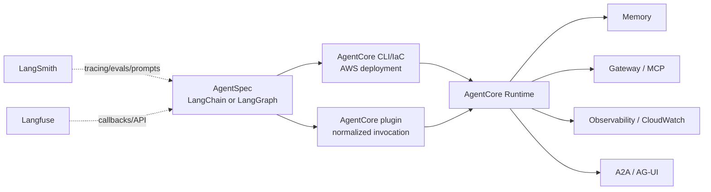

# AgentCore Integration

AgentBridge treats Amazon Bedrock AgentCore as a deployment and operations target, not as another
portable orchestration framework. A LangChain or LangGraph `AgentSpec` can be deployed through the
AgentCore CLI or infrastructure tooling, then invoked through the optional `agentbridge-agentcore`
plugin. The plugin keeps Runtime invocation normalized while preserving native AgentCore services.

## Coverage Contract

| AgentCore surface | AgentBridge connection | Evidence |
| --- | --- | --- |
| Runtime invocation | `AgentCore` backend and `AgentCoreClient.invoke_runtime()` | Offline adapter contract test |
| Memory | `memory_id` binding and normalized metadata/payload | Adapter test |
| Gateway and MCP | `gateway_url` binding plus native operation escape hatch | Config contract |
| Identity | `identity_provider` binding | Config contract |
| Observability | trace ID forwarding and observability metadata | Runtime client contract |
| A2A and AG-UI | protocol labels preserved for the deployed runtime | Capability metadata |
| Future AgentCore APIs | `AgentCoreClient.call(service, operation, ...)` | Dynamic native operation contract |

Install the AWS client only when this integration is used:

```bash
pip install -e 'plugins/agentbridge-agentcore[aws]'
```

AgentCore deployment publishing, IAM, containers, CloudWatch destinations, and account-level
governance remain AWS control-plane responsibilities. This boundary is deliberate: AgentBridge
connects application code to those services without inventing a second deployment platform.

The credential matrix includes an opt-in `agentcore_runtime` lane. It requires AWS credentials
available to boto3, `AWS_REGION`, and `AGENTBRIDGE_AGENTCORE_RUNTIME_ARN`; it is never run by the
default test suite.

## End-To-End Shape



## LangSmith and Langfuse

The LangChain plugin covers native tracing callbacks, prompt versioning, dataset/evaluation
publishing, arbitrary LangSmith JSON/SSE APIs, Langfuse callbacks, and a dependency-free Langfuse
JSON/SSE transport. AgentCore observability is an additional deployment-side signal path; it does
not replace LangSmith or Langfuse, and all three can be enabled through the same `AgentSpec`.

Use `examples/framework_to_agentcore_report.py` to produce a no-network comparison artifact for
local LangChain/LangGraph results and the configured AgentCore target.
