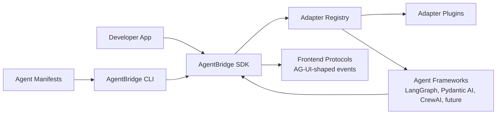
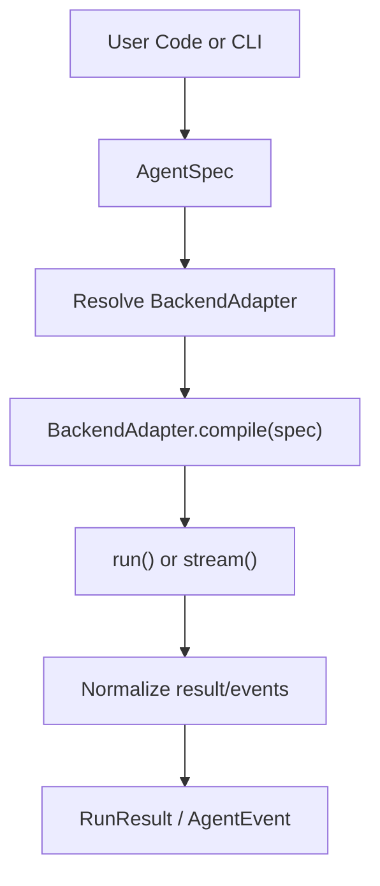
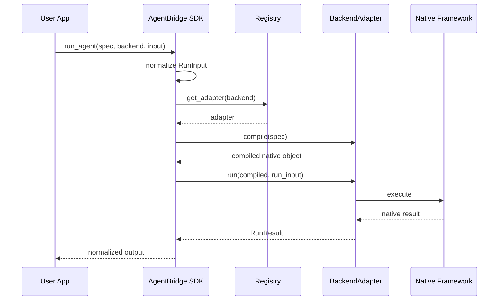
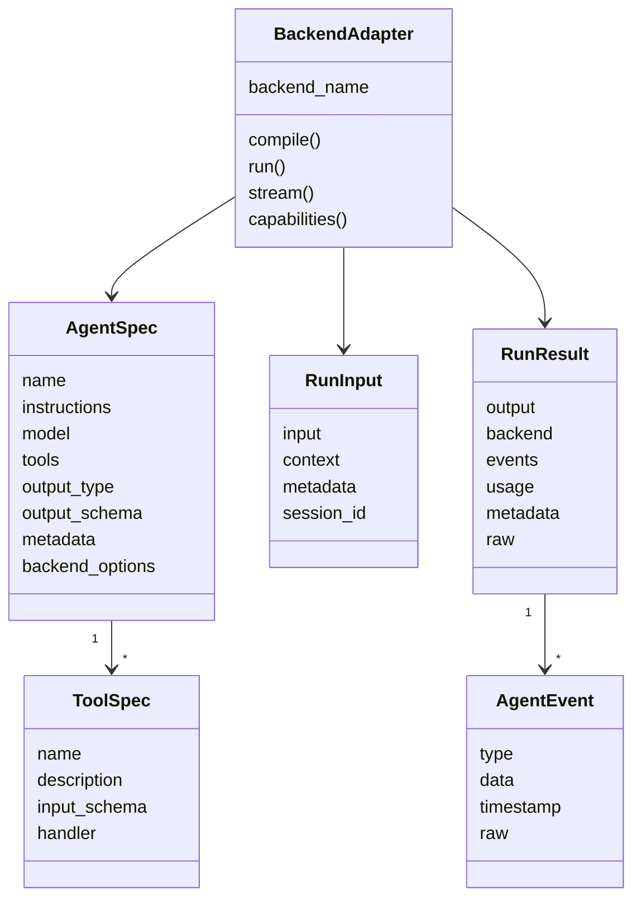
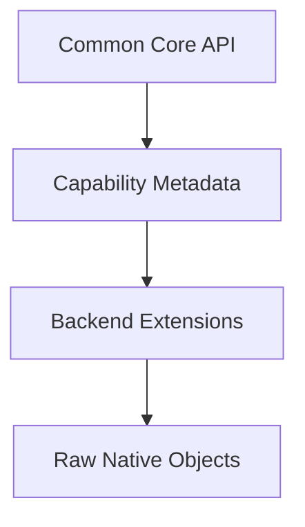
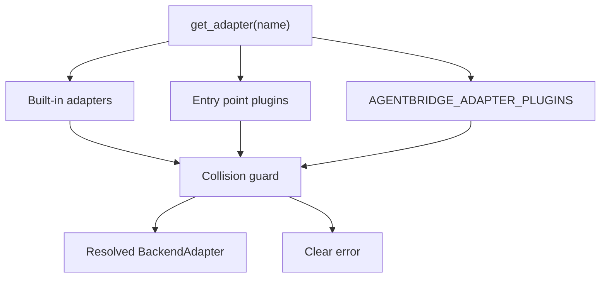
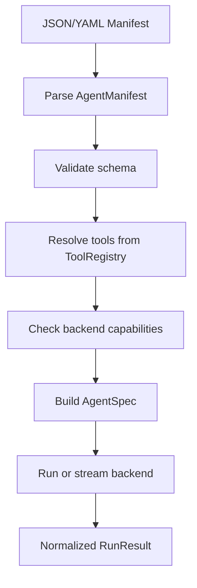
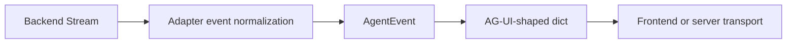
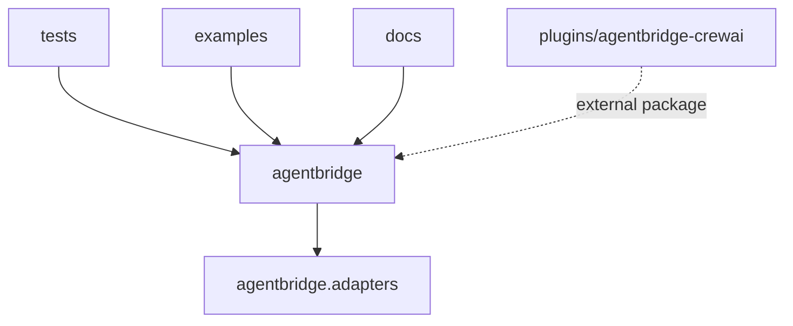

# AgentBridge Architecture

AgentBridge is a compatibility layer between application code and agent frameworks. It does not host agents, replace model providers, or implement every backend feature as a common denominator. It defines a stable core model, discovers an adapter, then lets that adapter translate into native framework behavior.

## Terminology

- Framework: The user-facing runtime choice, such as `langgraph`, `pydantic_ai`, or `crewai`.
- Backend adapter: The implementation object that translates AgentBridge types into a framework's native API.
- Capability: A feature a framework adapter advertises as `full`, `partial`, `extension`, `native_only`, or `unsupported`.
- Extension: Backend-specific AgentBridge API surface for framework nuances that should not be forced into the common core.
- Raw escape hatch: Native framework objects preserved for advanced users who need the full underlying runtime.

In SDK code, prefer `framework=`:

```python
run_agent(agent, framework="langgraph", input="Check refund eligibility")
```

`backend=` remains supported as a lower-level adapter alias and is still used by CLI inspection commands.

## System Context



## Core Flow



The same flow in sequence form:



## Core Types

- `AgentSpec`: Framework-neutral agent definition.
- `ToolSpec`: Python callable wrapper with JSON-schema-like input metadata.
- `output_type` / `output_schema`: Optional structured-output contract for typed SDK runs and serializable manifests.
- `RunInput`: Input text plus context, metadata, and session id.
- `AgentEvent`: Normalized event for messages, tool calls, tool results, errors, and completion.
- `RunResult`: Normalized result with output, backend, events, usage, metadata, and raw backend result.
- `ApprovalQueue`: Lightweight app-owned queue for pending human approval records and portable resume payloads.
- `BackendCapabilities`: Feature coverage metadata advertised by each backend.
- `BackendAdapter`: Framework adapter contract.
- `AgentManifest`: Static JSON/YAML agent definition used by the CLI and future migration tooling.



## Compatibility Philosophy

AgentBridge should not flatten every framework into the lowest common denominator. The long-term architecture has four layers:

- Common core: Features every backend can reasonably support, such as instructions, model, tools, input, output, and normalized events.
- Capability layer: Feature flags that describe what a backend supports, such as graph state, typed output, memory, human approval, retries, tracing, multimodal input, or multi-agent handoffs.
- Extension layer: Backend-specific configuration and helper APIs for concepts that are useful but not fully portable.
- App-owned coordination helpers: Plain-data helpers such as `ApprovalQueue` that bridge common workflow needs while leaving native execution semantics with each adapter.
- Native escape hatches: Backend-specific raw objects for features that cannot be expressed cleanly in the common model yet.



This lets AgentBridge expose a simple API without hiding the unique strengths of LangGraph, CrewAI, Pydantic AI, Google ADK, Strands, OpenAI Agents SDK, AgentCore, smolagents, AutoGen/AG2, LlamaIndex Workflows, and future frameworks.

## Adapter Responsibilities

- Translate `AgentSpec` into backend-native objects.
- Translate `ToolSpec` into backend-native tools.
- Normalize final outputs into `RunResult`.
- Normalize streaming behavior into `AgentEvent`.
- Keep raw backend objects available for users who need escape hatches.
- Publish backend capability metadata so users can inspect fit before running or migrating.

## Adapter Registry

AgentBridge exposes a small adapter registry so backends can be looked up by name:

- Built in: `mock`, `pydantic_ai`, `langgraph`.
- Custom adapters can be registered with `register_adapter()`.
- Optional dependencies are imported lazily by each adapter.
- External adapters can be loaded from the `agentbridge.adapters` entry point group or from `AGENTBRIDGE_ADAPTER_PLUGINS`.



Plugin packages cannot replace an existing backend unless `AGENTBRIDGE_ADAPTER_PLUGIN_OVERRIDES` explicitly names that backend. This protects users from accidental backend shadowing.

## Manifest And CLI Flow

AgentBridge supports static JSON/YAML manifests for no-code agent definitions that can be run from the CLI. v0 manifests intentionally do not execute tool declarations by import path because arbitrary Python callables cannot be safely deserialized from static files.

Manifest tools resolve only through an explicit `ToolRegistry`, which keeps static files safe while allowing named, pre-registered tools. The CLI ships with deterministic demo tools for examples; production apps should provide their own registry.



The `validate` command checks that manifest tools exist in a registry and compares required capabilities against selected backends before a run or migration attempt.

## Streaming And AG-UI Mapping

AgentBridge does not implement an AG-UI server in v0. It provides a converter from `AgentEvent` to AG-UI-shaped dictionaries so users can pipe normalized backend events into a frontend protocol later.



## Package Boundaries



Core should stay installable with only `pydantic`, `litellm`, and `pyyaml`. Optional frameworks belong behind extras or plugins.
