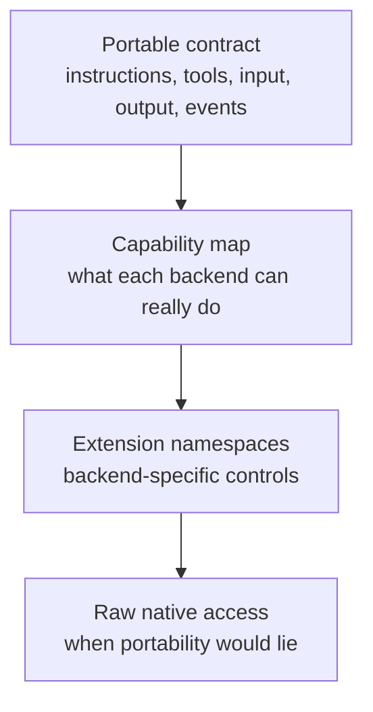
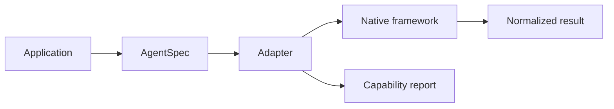

# Agent Framework Fragmentation

The agent ecosystem is fragmenting for good reasons. Different frameworks optimize for different jobs.

CrewAI is approachable for role, task, and crew-shaped prototypes. LangGraph is strong for durable, graph-shaped orchestration. Pydantic AI is compelling for typed Python-native agents. LangChain has a large integration ecosystem. Strands and AgentCore point toward AWS-oriented production paths. Google ADK aligns with Google Cloud and enterprise agent workflows. OpenAI Agents gives teams an OpenAI-native runtime path.

The problem is not that these frameworks exist. The problem is that application code often has to absorb every difference directly.

## Where Lock-In Appears

Framework coupling usually enters through small decisions:

- Tool wrappers use one framework's schema and callback shape.
- Results become framework-native objects instead of app-owned contracts.
- Streaming events are wired directly to one runtime.
- Memory and checkpoint behavior are mixed into application logic.
- Tests assume one framework's execution semantics.
- Deployment and observability settings become scattered across the app.

Each decision is reasonable in isolation. Together, they make migration expensive.

## Compatibility Does Not Mean Uniformity

A useful bridge cannot erase the reasons frameworks are different. It needs a layered model.

This is why AgentBridge tracks features as `full`, `partial`, `extension`, `native_only`, or `unsupported`. A framework may support a feature natively while AgentBridge only supports it through an extension. That distinction matters.

## What A Bridge Should Normalize

AgentBridge should normalize the parts that most applications should own:

- Agent definition shape.
- Tool declaration and safe registry patterns.
- Run input and session metadata.
- Final result shape.
- Stream event categories.
- Capability inspection.
- Adapter conformance checks.
- Scenario reports for migration decisions.

This gives teams enough stability to build apps and tests without hiding the backend.

## What A Bridge Should Not Normalize Too Early

Some features should not be forced into a fake universal API before the ecosystem settles:

- Deep graph state.
- Multi-agent delegation semantics.
- Human approval and resume semantics.
- Hosted eval and deployment systems.
- Framework-specific memory stores.
- Native tracing callbacks.

Those areas should start as extension namespaces or native escape hatches, then graduate only when there is enough evidence that a shared API is useful.

## The Practical Outcome

The useful version of AgentBridge is not a framework killer. It is an adapter contract, test harness, migration surface, and documentation discipline.

That bridge gives developers a way to ask: “What changes if we move this agent?” Today, too many teams only learn the answer during a rewrite.
