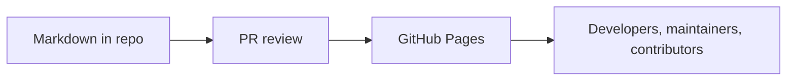

# AgentBridge Articles

These articles are written as shareable GitHub posts. They explain what AgentBridge is, why it should exist, and how the migration-first wedge grows into a broader compatibility layer.

## Posts

- [Why AgentBridge Exists](why-agentbridge.md): The product thesis and positioning against AG-UI and LiteLLM.
- [Agent Framework Fragmentation](agent-framework-fragmentation.md): Why teams feel trapped between fast prototypes and production runtimes.
- [Prototype To Production Migration](prototype-to-production-migration.md): A concrete migration story using AgentBridge as the compatibility layer.

## Publishing Model

The posts live in the repository first so they are readable directly on GitHub. GitHub Pages then publishes the same Markdown as a public documentation site.

