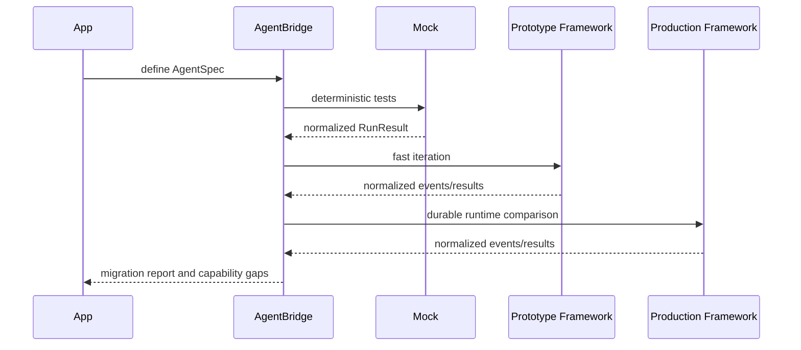
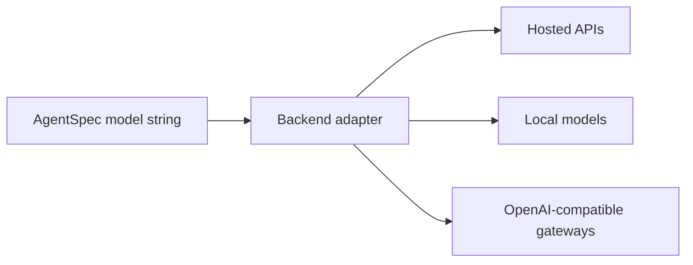

# Prototype To Production Migration

The first AgentBridge wedge is migration from fast prototypes to production-grade runtimes.

Imagine a support team building a refund agent. The first version needs to classify a customer request, inspect order status, decide refund eligibility, and produce a clear response. A high-level framework may be the fastest way to prototype that behavior. Later, production needs arrive: durable checkpoints, approval gates, audit logs, replayable tests, and stable frontend events.

AgentBridge is designed so the team can preserve the agent contract while changing the runtime underneath it.

## Starting Point

The app defines the portable shape:

```python
from agentbridge import AgentSpec, ToolSpec, run_agent


def check_order(order_id: str) -> str:
    """Return refund eligibility for an order."""
    return f"Order {order_id} is eligible for a refund."


agent = AgentSpec(
    name="refund_agent",
    instructions="Decide whether a customer is eligible for a refund.",
    model="openai/gpt-5",
    tools=[ToolSpec.from_function(check_order)],
)

result = run_agent(
    agent,
    framework="mock",
    input="Customer says order A123 was double charged.",
)
```

The `framework` parameter is the runtime choice. The app owns the agent shape; the adapter owns the translation into the native backend.

## Migration Flow



The team can use the mock backend for no-key tests, a prototype backend for iteration, and a production backend when state, resume, or observability become important.

## What Gets Compared

A good migration report should compare more than final text. It should record:

- Final output shape.
- Streamed message and tool events.
- Tool-call lifecycle behavior.
- Structured output support.
- State and checkpoint support.
- Human approval and resume behavior.
- Model routing options.
- Native-only gaps.
- Raw backend diagnostics.

This turns migration into an evidence-based decision instead of a rewrite gamble.

## Model Routes Matter

Production teams often need more than one model provider. They may test OpenAI, Anthropic, Google, NVIDIA NIM, OpenRouter, local Ollama-style models, or internal OpenAI-compatible gateways.

AgentBridge should not become a model gateway. It should record model routes and pass backend-native settings through clearly.



That is why model routing is documented as a first-class concern, while provider-specific API behavior remains outside the core abstraction.

## What Success Looks Like

Success is not “every backend behaves identically.” Success is knowing exactly which parts are portable and which parts are not.

For a refund agent, success looks like this:

- The same `AgentSpec` runs in tests without credentials.
- The prototype framework can use role/task or typed-output strengths through extensions.
- The production framework can use durable state and resume where supported.
- The frontend sees normalized events.
- The app receives the same `RunResult` shape.
- The migration report makes gaps visible before the team commits.

That is the path AgentBridge is building toward: prototype fast, migrate deliberately, and keep the application layer stable.
