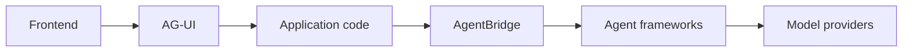
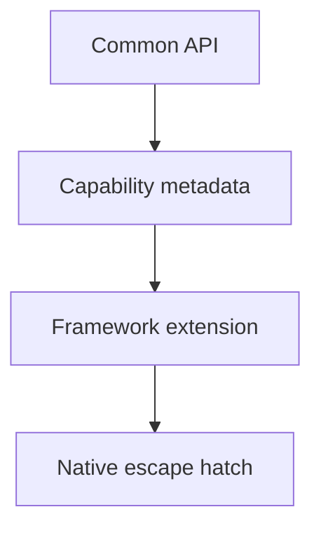

# Why AgentBridge Exists

Agent teams are making framework choices earlier than they realize.

A prototype might start with a high-level agent framework because the setup feels fast. A few weeks later, the same team may need durable state, structured output, human approvals, traceability, evals, local model routing, or a deployment target that the first framework does not fit cleanly. At that point, the application has often coupled itself to framework-specific prompts, tool wrappers, event formats, result objects, memory models, and test harnesses.

AgentBridge is the attempt to make that coupling explicit and movable.

## The Thesis

AG-UI standardizes how agentic systems talk to frontends. LiteLLM-style routing standardizes how applications talk to model providers. AgentBridge focuses on the layer between application code and agent frameworks.

The goal is not to pretend every agent framework is the same. LangGraph, CrewAI, Pydantic AI, LangChain, Strands, Google ADK, OpenAI Agents, and other systems each have their own strengths. AgentBridge should make the shared contract portable while preserving framework-specific nuance through capabilities, extension namespaces, and native escape hatches.

## What Developers Should Get

Developers should be able to define an agent once, then ask practical questions before committing to a runtime:

- Can this agent run on a deterministic mock backend for tests?
- Can the same shape run on Pydantic AI for typed output validation?
- Can it move to LangGraph when durable orchestration matters?
- Which framework features are portable, extension-only, native-only, or unsupported?
- What changes when the model route moves from OpenAI to NVIDIA NIM, OpenRouter, Ollama, or an internal OpenAI-compatible gateway?

That is the wedge: not a grand universal agent runtime, but a migration and comparison layer that lowers rewrite cost.

## Why Not Just Use One Framework?

One framework can be the right answer for a team. But the ecosystem is still moving quickly, and different organizations optimize for different things:

- Product teams want stable frontend events and user experience.
- Platform teams want conformance, policy, and version control.
- AI engineers want access to native framework strengths.
- Enterprises want migration paths and evidence before standardizing.

AgentBridge gives those groups a shared interface without forcing them into a lowest-common-denominator abstraction.

## The Boundary

AgentBridge should stay honest about what is verified.

If a feature is portable, it belongs in the common API. If it is real but backend-specific, it belongs in an extension namespace. If abstraction would be misleading, it should remain native-only and documented as such.

That honesty is why the project uses labels like `Verified locally`, `Partial`, and `Blocked`. The label is not a marketing grade; it is an evidence trail.

## The Long-Term Goal

The long-term goal is a compatibility layer that lets agent applications survive framework change.

AgentBridge should help a team start small, compare backends, keep event and result handling stable, document framework-specific gaps, and migrate toward the runtime that fits production needs.

That is the practical promise: fewer rewrites, clearer tradeoffs, and a healthier path from prototype to production.
