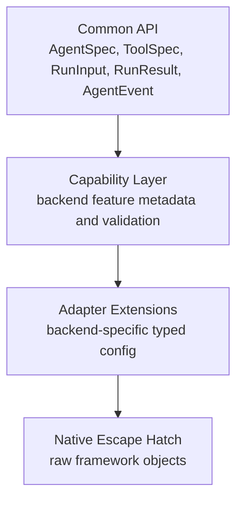
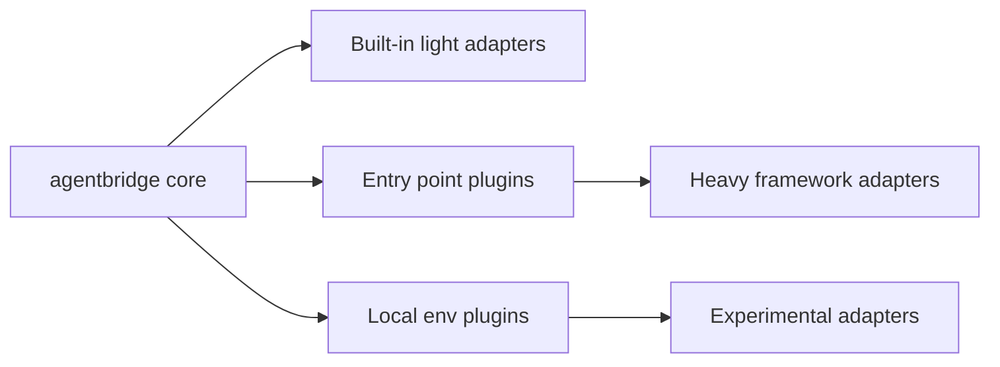
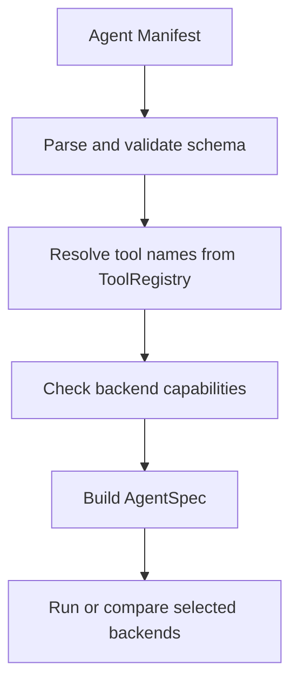

# Design Notes

AgentBridge is designed around one question:

> Can application code talk to agent frameworks through a stable compatibility layer without erasing what makes each framework useful?

The answer should be yes, but only if the abstraction is honest about capability differences.

## Design Goals

- Keep simple agent definitions portable across frameworks.
- Make migration experiments cheap and measurable.
- Normalize outputs and stream events for application code.
- Let users inspect backend capabilities before committing to a migration.
- Keep heavyweight or fragile frameworks outside the core install path.
- Preserve backend-native raw objects when the shared model is not enough.

## Non-Goals

- Do not build another model-provider gateway. LiteLLM-style model strings are enough for v0.
- Do not host a runtime server in v0.
- Do not implement a full AG-UI server/client stack in v0.
- Do not promise automatic migration of existing framework projects.
- Do not flatten multi-agent, graph, task, memory, and human-review systems into a fake universal object.

## Core Abstraction Boundary

The common API should stay small. Features graduate into the common API only when at least two target backends can support them with similar semantics.

## Framework Nuance Strategy

AgentBridge should eventually adopt the nuance of every supported framework, but not by forcing every feature into `AgentSpec`.

The rule is:

- Put portable semantics in the common API.
- Put variable support in capability metadata.
- Put framework-specific but useful behavior in extension namespaces.
- Keep native-only behavior reachable through raw backend objects.

For example, LangGraph checkpointing, CrewAI crew/task structures, and Pydantic AI output validation are all important. They should all be adoptable, but they should not be squeezed into one misleading lowest-common-denominator field. AgentBridge should expose the common path first, then add adapter-specific extension modules that preserve each framework's actual mental model.

SDK examples should use `framework=` because that is how users think about the choice. Internally, framework choices resolve to backend adapters.

## Why A Plugin System Exists

Agent frameworks often bring large dependency trees and fast-moving version constraints. If every adapter ships inside the core install path, AgentBridge becomes hard to install and easy to break.

The plugin design keeps the core package stable:

This allows `pip install agentbridge` to stay lightweight while still supporting frameworks such as CrewAI, Google ADK, Strands, AgentCore, smolagents, AutoGen/AG2, and others through separate packages.

## Manifest Design

Manifests are intentionally static and safe:

- They define agent shape.
- They reference tools by name.
- They do not deserialize arbitrary Python functions.
- They can be validated against backend capabilities before execution.

This design keeps CLI usage useful without turning YAML into an unsafe execution format.

## Event Design

`AgentEvent` is the bridge between backend-specific streaming and frontend protocols.

AgentBridge normalizes:

- Message events.
- Tool call events.
- Tool result events.
- Error events.
- Completion events.

AG-UI compatibility is intentionally event-shape conversion only in v0. A full AG-UI server would be a separate layer.

## Adapter Design Contract

Every adapter owns four responsibilities:

- Compile `AgentSpec` into native backend objects.
- Convert `ToolSpec` into backend-native tools.
- Normalize backend results and stream events.
- Declare capability metadata and preserve raw escape hatches.

Adapter code should avoid importing optional dependencies at module import time when possible. Missing optional dependencies should produce clear install instructions.

## Tradeoffs

| Decision | Benefit | Cost |
| --- | --- | --- |
| Small common API | Easy to learn and test | Advanced features need capability or extension paths. |
| Plugin adapters | Keeps core install stable | More packaging work per adapter. |
| Static manifests | Safe CLI workflows | Tool execution requires explicit registry setup. |
| Raw escape hatches | Does not block native power users | Users can write backend-specific code when needed. |
| LiteLLM-style model strings | Avoids duplicating model gateway work | Provider-specific edge cases stay outside AgentBridge. |

## Design Principle For New Features

When adding a feature, choose the narrowest honest layer:

1. Add to common API only if semantics are portable.
2. Add to capability metadata if support varies.
3. Add to an adapter extension if the concept is backend-specific but useful.
4. Leave as `raw` if abstraction would mislead users.
