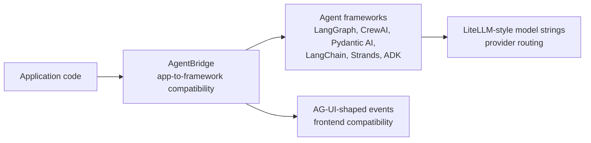
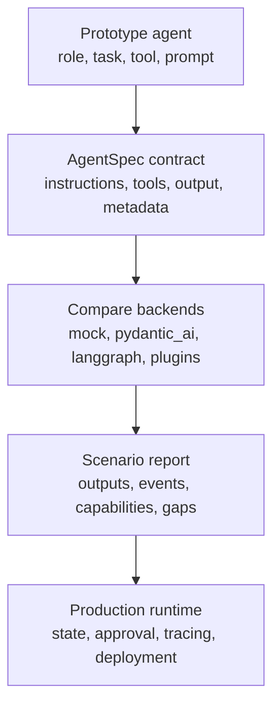
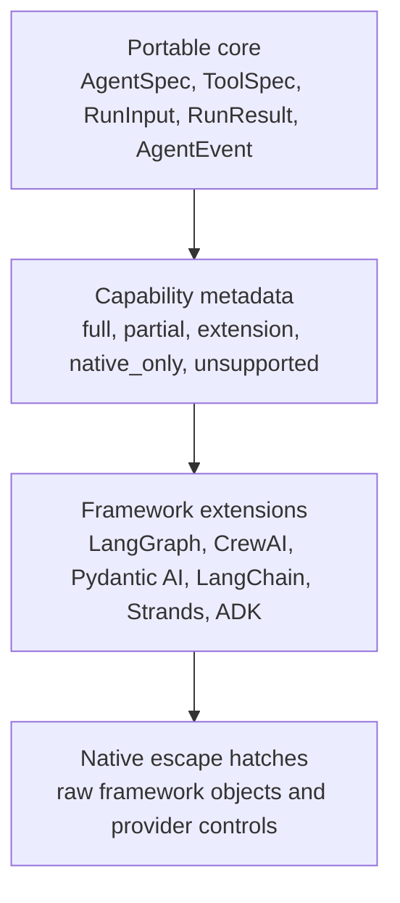
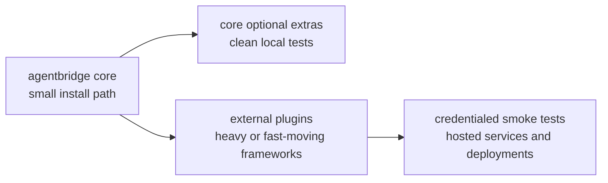
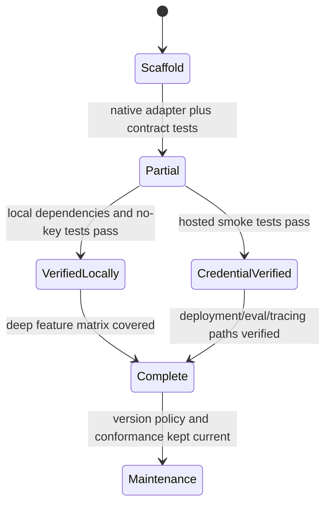

# AgentBridge Visual System Maps

This page collects the high-level visuals for explaining AgentBridge in articles, README sections, architecture reviews, and future GitHub Pages posts.

## Market Position

AgentBridge sits above framework runtime selection and below application code. It does not replace AG-UI or LiteLLM; it complements them.

## Migration Wedge

The first wedge is migration. Teams should be able to capture a working agent shape, compare framework fit, and move toward a production runtime with less rewrite risk.

## Capability Layers

The goal is not to flatten every framework into a weak common denominator. The goal is to make portability explicit while still preserving framework-specific power.

## Plugin Boundary

Core stays small. Frameworks with heavier dependencies, hosted services, or fast-moving constraints live as plugins until they are stable enough to justify a tighter integration.

## Status Graduation

Status labels should change only when evidence changes. A single provider smoke test proves one route, not every framework feature.
