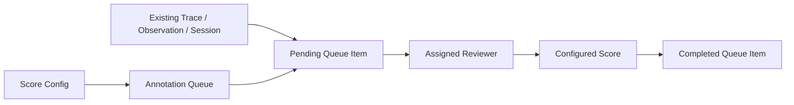

# Evaluation

AgentBridge provides a small, backend-neutral evaluation contract for local
regression tests and CI. It is intentionally independent of LangSmith,
Langfuse, or any model provider, so the same test dataset can run without
credentials and then be connected to a hosted evaluation system later.

## Basic Usage

```python
from agentbridge import EvaluationExample, evaluate_agent

report = evaluate_agent(
    agent,
    backend="mock",
    dataset=[
        EvaluationExample(
            input="Check order A123",
            expected_output="eligible",
        ),
    ],
    evaluators={
        "contains_order": lambda example, result: "A123" in str(result.output),
    },
)

assert report.summary["error_count"] == 0
```

An evaluator receives the original `EvaluationExample` and normalized
`RunResult`. It may return a number/boolean, a mapping with `score`, `value`,
`comment`, and `metadata`, or an `EvaluationScore` instance. The resulting
`EvaluationReport` contains one `EvaluationCase` per example, preserving
backend output and per-case failures.

Run the complete example without a provider key:

```bash
python examples/evaluate_refund_agent.py
```

## LangSmith Boundary

LangSmith supports datasets, offline and online evaluations, code evaluators,
LLM-as-judge evaluators, pairwise comparisons, and summary evaluators. The
AgentBridge core contract covers the portable local execution layer first.
The LangChain plugin can attach tracing through its existing observability
configuration, while hosted dataset/evaluator publishing belongs in an
optional integration package so core remains dependency-free.

That integration must preserve the following fields when publishing a run:

- dataset and example identifiers;
- AgentBridge backend and adopted framework version;
- normalized input, output, events, usage, and error;
- evaluator key, score/value, comment, and metadata;
- model route and trace/session identifiers.

This makes a local CI report and a LangSmith experiment comparable without
making hosted LangSmith a required runtime dependency.

## Langfuse Typed Publication And Export

The LangChain plugin publishes reports to Langfuse and exports them through
the [Scores v3 API](https://langfuse.com/docs/api-and-data-platform/features/public-api).
Install the plugin before using these helpers:

```bash
python -m pip install -e plugins/agentbridge-langchain
python examples/langfuse_typed_evaluation.py
```

The example uses an injected transport, not a hosted API. It demonstrates
numeric, boolean, categorical, and text scores, trace subjects, metadata,
paginated export, and matching synchronous/asynchronous results without keys.

For a hosted project, configure `LANGFUSE_PUBLIC_KEY` and `LANGFUSE_SECRET_KEY`,
and pass your regional or self-hosted URL as `base_url` when constructing the
client. Then publish an existing report:

```python
from agentbridge_langchain import LangfuseAPIClient, publish_report_scores

client = LangfuseAPIClient(base_url="https://cloud.langfuse.com")
published = publish_report_scores(
    report,
    trace_ids={0: "existing-trace-id"},
    score_types={"verdict": "CATEGORICAL"},
    client=client,
)
scores = list(client.iter_scores_v3(query={"fields": "details,subject"}))
```

`EvaluationScore.value` takes precedence over `score` when present. Booleans,
strings, and numbers infer `BOOLEAN`, `TEXT`, and `NUMERIC`, respectively;
use `score_types` for categorical strings. Comments and score metadata are
preserved, as is example metadata when publishing datasets. Scores without a
value and cases without a mapped trace ID are skipped.

Publishable values are checked for scalar types before any score writes start.
This is not a transaction: network or server validation failures can leave
earlier scores published. The report helper does not assign idempotency IDs;
use the lower-level `create_score()` when controlling retry identity or other
native score targets and options.

Async pipelines use `apublish_report_scores()` and `aiter_scores_v3()`:

```python
from agentbridge_langchain import apublish_report_scores

async def publish_and_export(report, client):
    await apublish_report_scores(
        report, trace_ids={0: "existing-trace-id"}, client=client,
        score_types={"verdict": "CATEGORICAL"},
    )
    return [score async for score in client.aiter_scores_v3(
        query={"fields": "details,subject", "experimentId": "experiment-id"},
    )]
```

Both iterators preserve caller filters, follow opaque server cursors, and raise
an explicit incomplete-export error for cursor cycles or malformed pages.
Records already yielded before an error are partial results, not a complete
export. Request suitable filters to avoid exporting the whole project.
Observations, experiments, and experiment items use the same cursor validation
in `iter_observations()`, `iter_experiments()`, `iter_experiment_items()`, and
their async counterparts. Missing metadata is rejected, while native terminal
metadata with an omitted or null cursor is accepted. Cursor strings are opaque
and URL-encoded without being interpreted; numbered-page queries are rejected
on these cursor endpoints before making a request.

## Langfuse Dataset And Prompt Pagination

Unlike Scores v3, the prompt, dataset, and dataset-item list endpoints use
numbered pages. Their sync and async iterators follow `meta.page` and
`meta.totalPages`, preserve filters and historical dataset-item versions,
and leave the caller's query unchanged. This follows the
[Langfuse OpenAPI schema](https://cloud.langfuse.com/generated/api/openapi.yml).

```python
items = list(client.iter_dataset_items(query={
    "datasetName": "refunds", "version": "2026-01-21T14:35:42Z",
    "page": 2, "limit": 100,
}))
prompts = list(client.iter_prompts(query={"label": "production", "tag": "refunds"}))
datasets = list(client.iter_datasets(query={"limit": 100}))
```

Use `aiter_dataset_items()`, `aiter_prompts()`, and `aiter_datasets()` in async
pipelines. Starting pages must be positive integers. These endpoints do not
accept a cursor; the iterators reject it before making a request. Unexpected
page numbers or malformed records/pagination metadata raise an explicit
incomplete-export error instead of silently returning the first page.

Run the no-key sync/async example:

```bash
python examples/langfuse_paginated_export.py
```

These are sequential list reads, not snapshot isolation. Pin a dataset-item
version when reproducible historical item membership is required; prompts and
datasets can change during an export.

The offline example also exports observations, scores, experiments, and
experiment items using cursor pagination. Supply a bounded time range for
hosted exports; the experiment APIs require `fromStartTime`. The scheduled
[API contract drift check](upstream_compatibility.md#langfuse-api-contract-drift)
detects changes to these adopted pagination contracts.

## Langfuse Human Review Governance

The plugin exposes Langfuse's native
[annotation queues](https://langfuse.com/docs/evaluation/evaluation-methods/annotation-queues)
and score-configuration operations through `LangfuseAPIClient`. These queues
organize evaluations of existing traces, observations, or sessions. They are
not execution-blocking AgentBridge approvals and do not resume an interrupted
agent run.



```python
from agentbridge_langchain import LangfuseAPIClient, publish_report_scores

client = LangfuseAPIClient(base_url="https://cloud.langfuse.com")
config = client.create_score_config(name="refund_approved", data_type="BOOLEAN")
queue = client.create_annotation_queue(
    name="refund_review", score_config_ids=[config["id"]],
)
client.create_annotation_queue_assignment(queue["id"], user_id="existing-project-user-id")
item = client.create_annotation_queue_item(
    queue["id"], object_id="existing-trace-id", object_type="TRACE",
)
pending = list(client.iter_annotation_queue_items(queue["id"], query={"status": "PENDING"}))

# Publish scores from an existing evaluation report against this scoring dimension.
publish_report_scores(
    report, trace_ids={0: "existing-trace-id"}, client=client,
    score_config_ids={"refund_approved": config["id"]},
)
```

After the actual reviewer submits a score, update the item using
`update_annotation_queue_item(queue_id, item_id, body={"status": "COMPLETED"})`.
Submitting a score and marking the queue item complete are separate operations;
the bridge does not infer completion or impersonate a human reviewer.

| Resource | Supported Helpers |
| --- | --- |
| Score configs | `create_score_config`, `get_score_config`, `update_score_config`, `list_score_configs`, `iter_score_configs` |
| Queues | `create_annotation_queue`, `get_annotation_queue`, `list_annotation_queues`, `iter_annotation_queues` |
| Queue items | `create_annotation_queue_item`, `get_annotation_queue_item`, `update_annotation_queue_item`, `delete_annotation_queue_item`, `list_annotation_queue_items`, `iter_annotation_queue_items` |
| Reviewer assignments | `create_annotation_queue_assignment`, `delete_annotation_queue_assignment` |

Every helper has an async counterpart prefixed with `a`. List iterators use
native numbered pagination and preserve filters. Identifier path segments are
URL-escaped, and empty or traversal identifiers are rejected before requests.
Update payloads preserve explicit nulls and false values. Numeric config bounds,
categorical labels/values, descriptions, and config archive state retain their
native representation. Server-side validation, project membership, and API-key
permissions still apply.

Both report publishers accept `score_config_ids` keyed by evaluator name. This
forwards `configId` but does not fetch configs or automatically reconcile their
types with evaluator values. Use matching evaluator types and dimensions.

For cleanup, remove queue items or reviewer assignments and archive a config
with `update_score_config(config_id, body={"isArchived": True})`. The current
public API does not expose queue deletion or score-config deletion, so the
bridge does not invent such endpoints. Operations are not transactional;
network failures can leave partial state, and retries require application-owned
reconciliation.

Run the stateful no-key workflow and sync/async comparison:

```bash
python examples/langfuse_review_queue.py
```

Its rejection is an explicit fixture decision, not a real human review. The
example uses no hosted service and does not establish production authorization
or annotation UI behavior. The weekly schema check covers pagination for score
configs, queues, and queue items, plus the eight adopted governance write
contracts; it does not cover every Langfuse endpoint.
