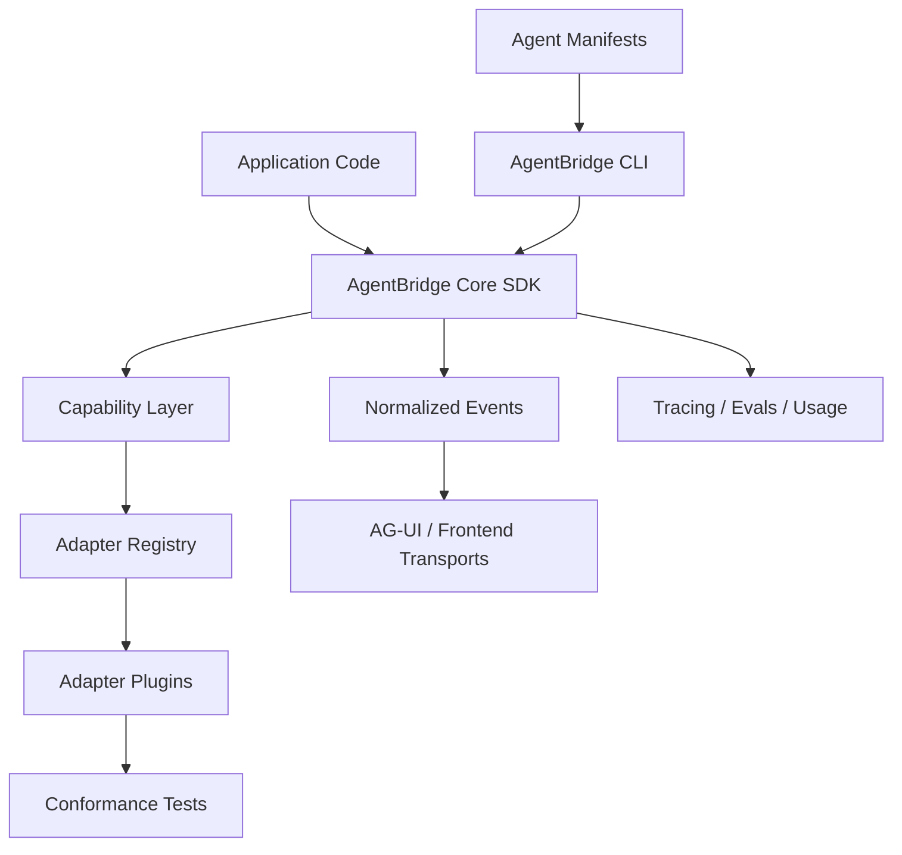

# AgentBridge Vision And Target State

This document is the north star for AgentBridge. It captures what we are ultimately trying to build, why it matters, which plugin families we expect to support, and how we decide what work belongs next.

## Final Target

AgentBridge should become the compatibility layer for agent applications.

The final target is:

> A developer defines agent intent, tools, events, state, and deployment expectations once, then can run, compare, migrate, or extend that agent across the major agent frameworks without rewriting the application layer.

AgentBridge should feel similar to what LiteLLM did for model providers, but at the agent-framework layer:

- LiteLLM: one interface over many model providers.
- AG-UI: one event protocol between agents and frontends.
- AgentBridge: one compatibility layer between apps and agent frameworks.

## Why This Should Exist

Agent framework choice is becoming a long-term architecture decision. Teams often start with whichever framework helps them prototype fastest, then later discover they need different strengths:

- Durable state and graph control.
- Typed outputs and validation.
- Multi-agent orchestration.
- Human approval and resume.
- Tracing and evals.
- Deployment on a specific runtime.
- Tool ecosystem compatibility.
- Frontend event streaming.

Without a bridge, switching frameworks means rewriting prompts, tools, event handling, result handling, state handling, and tests. AgentBridge should reduce that migration cost.

## Product Goals

- Define a framework-neutral agent contract that is useful for real applications.
- Let developers run the same agent specification on multiple backends.
- Make backend differences visible through capability metadata instead of hiding them.
- Give teams migration and comparison tooling before they commit to a new runtime.
- Provide deep scenario reports that show framework nuance, migration deltas, normalized outputs,
  and model routing across hosted APIs, local models, and OpenAI-compatible providers.
- Keep core installation lightweight.
- Let heavy, experimental, or framework-specific adapters live as plugins.
- Preserve native backend escape hatches for advanced users.
- Build a conformance suite so adapters can prove compatibility.

## Non-Goals

- AgentBridge should not become a model-provider gateway.
- AgentBridge should not host agents in v0 or v1.
- AgentBridge should not hide framework-specific strengths behind fake portability.
- AgentBridge should not import arbitrary Python from static manifests.
- AgentBridge should not require every user to install every framework dependency.
- AgentBridge should not claim support for a feature unless tests cover that support.

## Target User Groups

| User | Need | AgentBridge Value |
| --- | --- | --- |
| Startup builders | Prototype quickly without locking into one framework | Start with a simple backend, migrate later. |
| Platform teams | Standardize agent interfaces across teams | Enforce specs, validation, version policy, and adapter contracts. |
| AI engineers | Compare frameworks without rewriting agents | Run the same spec across backends. |
| Product teams | Keep frontend event handling stable | Normalize stream events and AG-UI-shaped output. |
| Framework/plugin authors | Reach AgentBridge users without entering core | Publish adapter plugins. |
| Enterprise teams | Manage migration risk | Inspect capabilities and run conformance tests. |

## Final Architecture Shape

## Capability Target

AgentBridge should eventually cover these capability areas:

| Area | Target |
| --- | --- |
| Agent definition | Instructions, role, goal, persona, model string, metadata, backend config. |
| Tools | Sync tools, async tools, JSON schema, MCP tools, tool approval, error policy. |
| Structured output | Pydantic models, JSON schema, validation, retry-on-invalid-output. |
| Workflow | Graphs, tasks, crews, conditional routing, handoffs, parallel steps. |
| State | Session state, checkpoints, memory, durable resume, scoped context. |
| Streaming | Message deltas, tool lifecycle events, custom events, completion events. |
| Human-in-the-loop | Approval gates, interrupts, review queues, resume after decision. |
| Runtime controls | Timeouts, retries, cancellation, concurrency, idempotency. |
| Observability | Traces, spans, logs, eval hooks, usage, cost, latency. |
| Model routing | LiteLLM-style strings, backend-native model settings, local model paths, and OpenAI-compatible gateways. |
| Deployment | Local, serverless, hosted runtime, workers, containers, background jobs. |
| UI protocols | AG-UI-shaped event conversion, later server examples. |
| Multi-agent | Teams, swarms, delegation, role/task mapping, agent-to-agent protocols. |
| Modalities | Text, files, images, audio, browser, computer use where backend supports it. |

Capability support must be explicit:

- `full`: Supported through AgentBridge and covered by contract tests.
- `partial`: Supported with documented limits.
- `extension`: Supported through a backend-specific extension namespace.
- `native_only`: Available through raw backend objects only.
- `unsupported`: Not supported by that adapter or backend.

## Plugin Families

AgentBridge should grow through plugin families rather than forcing all integrations into core.

### Framework Adapter Plugins

These plugins run `AgentSpec` on an agent framework.

| Target | Plugin Name Target | Why It Matters | Expected Home |
| --- | --- | --- | --- |
| LangGraph | `agentbridge-langgraph` | Durable graph orchestration, state, checkpoints. | Core optional until dependency pressure says otherwise. |
| Pydantic AI | `agentbridge-pydantic-ai` | Typed Python-native agents and structured output. | Core optional until dependency pressure says otherwise. |
| CrewAI | `agentbridge-crewai` | Role/task/crew prototyping and multi-agent teams. | External plugin. |
| OpenAI Agents SDK | `agentbridge-openai-agents` | OpenAI-native agent runtime and tools. | External plugin unless core strategy changes. |
| Strands Agents | `agentbridge-strands` | AWS-oriented agent SDK path with MCP, hooks, and AgentCore alignment. | External plugin. |
| LangChain | `agentbridge-langchain` | Existing LangChain agents, tools, middleware, memory, retrievers, and callback/tracing ecosystem. | External plugin. |
| Google ADK | `agentbridge-google-adk` | Google ecosystem agent development. | External plugin. |
| AgentCore | `agentbridge-agentcore` | Production agent runtime target. | External plugin. |
| Hugging Face smolagents | `agentbridge-smolagents` | Lightweight open-source agent experimentation. | External plugin. |
| LlamaIndex Workflows | `agentbridge-llamaindex` | RAG-heavy workflow and indexing ecosystem. | External plugin. |
| AutoGen / AG2 | `agentbridge-autogen` | Multi-agent conversations and group chats. | External plugin. |
| Semantic Kernel | `agentbridge-semantic-kernel` | Enterprise orchestration across Python/.NET ecosystems. | External plugin. |
| Haystack | `agentbridge-haystack` | Search/RAG pipelines and agent workflows. | External plugin. |
| DSPy | `agentbridge-dspy` | Prompt/program optimization workflows. | External plugin. |
| Vercel AI SDK bridge | `agentbridge-vercel-ai` | JavaScript/frontend agent app interoperability. | External bridge or companion package. |

This table is not final. It is the known target universe we should keep expanding as frameworks emerge.

See [Adapter Target Research](adapter_target_research.md) for the current adapter priority plan and implementation notes for OpenAI Agents SDK, Strands, direct LangChain, and Google ADK.

### Tool Ecosystem Plugins

These plugins standardize tool sources rather than complete agent runtimes.

| Target | Purpose |
| --- | --- |
| MCP tool registry | Import MCP tools into `ToolSpec` safely. |
| OpenAPI tool registry | Convert OpenAPI operations into `ToolSpec`. |
| Python package tool registry | Load explicitly exported Python tools from trusted packages. |
| Browser/computer-use tools | Normalize browser and desktop-control tools where safe. |
| Code execution tools | Bridge sandboxed code execution into agent tools. |
| Data tools | Connect SQL, vector stores, documents, spreadsheets, and file search. |

### Protocol Plugins

These plugins connect AgentBridge to protocols and transports.

| Target | Purpose |
| --- | --- |
| AG-UI server example | Serve normalized events through an AG-UI-compatible path. |
| A2A / agent-to-agent bridge | Explore cross-agent communication protocols. |
| WebSocket transport | Stream `AgentEvent` to web clients. |
| Queue/background transport | Run long-lived jobs and stream status later. |

### Observability Plugins

These plugins should make backend behavior measurable.

| Target | Purpose |
| --- | --- |
| OpenTelemetry | Export spans around runs, tools, and backend calls. |
| LangSmith | Support teams already using LangChain/LangGraph observability. |
| Braintrust | Evals and experiment tracking. |
| Arize/Phoenix | Tracing and evaluation workflows. |
| Custom event sink | Let teams write normalized events to their own logs. |

### Deployment Plugins

These plugins package or run AgentBridge-compatible agents.

| Target | Purpose |
| --- | --- |
| FastAPI server | Serve AgentBridge agents through HTTP. |
| Cloudflare Workers / Agents | Explore durable serverless agent deployment. |
| Docker template | Standard production container shape. |
| Background workers | Celery/RQ/queue-friendly execution. |

## Core Versus Plugin Rule

Keep something in core only if it satisfies all of these:

- It is required for the shared abstraction.
- It has a small and stable dependency footprint.
- It can be tested without paid API calls.
- It benefits nearly every user.
- It does not force one framework's mental model onto the rest.

Move something to a plugin if:

- It has heavy dependencies.
- It has fragile or fast-moving dependency constraints.
- It targets one framework or provider.
- It requires credentials or hosted services to test meaningfully.
- It exposes features that are valuable but not portable.

## Extension Namespace Rule

Framework nuance should move into extension namespaces when it is too specific for `AgentSpec` but important enough to support intentionally.

Examples:

- LangGraph checkpointing, interrupts, resume, and conditional routing.
- CrewAI crews, roles, tasks, delegation, and process modes.
- Pydantic AI validation retries, dependency injection, and typed output behavior.
- Google ADK session/app concepts.
- Strands hooks, MCP clients, trace attributes, and AgentCore runtime/deployment primitives.
- LangChain middleware, callbacks, memory, retrievers, and LangSmith-style tracing.

Extension namespaces should feel native to the framework they represent. They are how AgentBridge can eventually cover "all of it" without turning the common API into a confusing mega-object.

## Scenario Report Rule

Every major adapter should eventually have at least one deep scenario report. Reports should show
realistic framework-specific features being used through AgentBridge, a migration or comparison
against another backend, normalized output/event shapes, and model routing variants. Default report
examples must run without paid credentials, while optional smoke sections can document OpenAI,
Anthropic, Google, local Ollama-style models, OpenRouter, NVIDIA NIM, or custom OpenAI-compatible
gateways when credentials are available.

## Milestone Target State

### v0: Foundation

- Core SDK types.
- Adapter registry.
- Mock backend.
- First optional real adapters.
- Static manifests.
- CLI run, validate, compare, versions, plugins.
- External plugin scaffolder.
- Docs for architecture, requirements, versioning, and roadmap.

### v0.1: Credible Real Backends

- LangGraph minimal graph execution with better state handling.
- Pydantic AI typed output path.
- CrewAI external plugin verified in compatible environment.
- Shared refund-agent contract test across at least two real backends.
- Capability matrix generated from adapter metadata.

### v0.5: Migration Toolkit

- Import helpers for common CrewAI, LangGraph, and Pydantic AI project shapes.
- Backend fit reports.
- Tool registry extensions.
- Structured output compatibility checks.
- Streaming compatibility checks.
- Example migration guides.

### v1: Compatibility Standard

- Stable manifest format.
- Adapter conformance test suite.
- Public plugin authoring standard.
- Capability reports for major frameworks.
- AG-UI server example.
- Observability hooks.
- Production-grade documentation.

### v2: Ecosystem

- Broad framework adapter plugin ecosystem.
- Tool/protocol/observability/deployment plugin families.
- Compatibility certification for adapters.
- Extension namespaces for advanced framework-specific features.
- Migration examples for real-world agent apps.

## Success Criteria

AgentBridge is working if:

- A developer can define one useful `AgentSpec` and run it on multiple backends.
- Migration from prototype to production runtime requires changing configuration, not rewriting the app.
- Backend-specific strengths are discoverable rather than hidden.
- Adapter authors can ship plugins without modifying core.
- Capability claims are backed by tests.
- The docs clearly explain what is supported, what is partial, and what is native-only.

## Operating Principles

- Be honest about limitations.
- Prefer small stable core plus powerful plugins.
- Test every claim.
- Document adopted and verified versions.
- Preserve native escape hatches.
- Optimize for migration clarity, not abstraction purity.
- Let the ecosystem expand without making every user pay every dependency cost.
